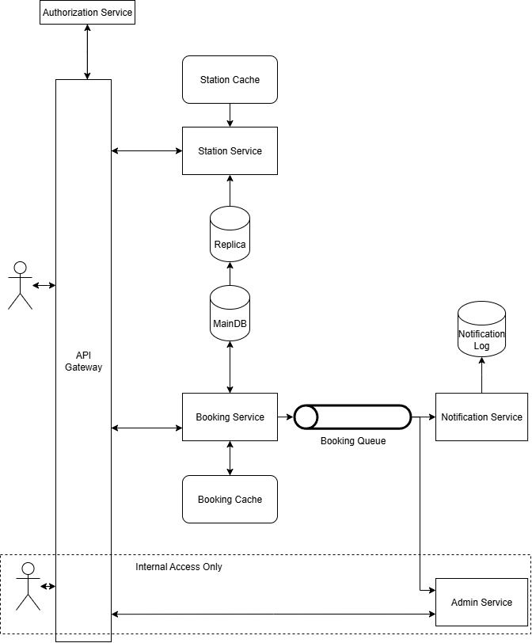

# General Design

As the starting point, let’s describe all elements of the system, their general purpose with later a more detailed analysis of each component.

In this diagram, all arrows represent direct and sync communication while items with a topic (tunnel) drawing correspond to asynchronous communication elements.

Please note that for simplicity the Admin service was not connected to cache and DBs to keep the diagram clean.

## Main Services

### Station Service

Responsible for providing all station related information, its main purpose is to attend to all queries and listing, to search all nearby stations and the details of each station, in this case study, the occupancy of the station itself.

The service relies on both cache and postGIS indexes to retrieve the data.

### Booking Service

Responsible for receiving and confirming all booking operations. Uses both cache and DB to validate if the booking slot is free. Once a booking is complete, that will be registered and also posted as a message for other services.

## Support Services

### Authorization Service

Auth authority and authorization provider for all services. Validates received credentials and if they are valid, returns the profile/grants that the user has (Different user levels, admin levels).

### Notification Service

A simple consumer that receives booking events and call/schedule notifications according to the user preference. Its purpose is to reduce the number of operations performed by the booking service.

### Admin Service

An extra service, ideally accessible only through a VPN/specific entry point for other operations outside the regular user flow. E.g.: Broken charging stations notification, support operations.

Also consumes booking events for extra operations: E.g.: User cancelled a booking, so caches for that station needs to be invalidated.

## Other Components

### API Gateway

Communication gateway between the external front end and the whole backend, not only fills the role of single point of contact but also will be responsible for other features such as:

- Authentication: By connecting to the Authentication service it validates all requests before calling any of the services, only forwarding valid requests that will be already pre-authorized. Search, Booking and Admin services from their side can then check the access permissions and perform their operations.  

- Rate limiting: Avoid constant repeated requests for the same operation/sudden bursts from an user.  

- Reduced exposure: Frontend/mobile applications only need to know how to reach the API Gateway instead of having to know each component of the backend.

### Cache (Redis)

#### Station Cache

Charging station information and booking status

#### Booking Cache

Booking status information and concurrent access control.

### Database (Postgres + postGIS)

Two instances, main and replica. The main database will be used by the booking service, while the read-only replica (or multiple replicas) will be read by the station service, trying to mitigate impacts on both operations if one of them is more demanding than the other.

### Booking Queue

An async topic for all booking events (new bookings, cancellations) to be consumed by notification and admin services.

# Detailed look

## Station Service

Planned to attend two requests, both operations that only read data. First from the cache and then from the database if required.

- GET - /stations - List all the stations nearby
  - Query Params: Latitude, Longitude and Radius
  - Can be combined with station details to also have the availability of them ready to render on the front-end side.

The initial query can take advantage of a location index on the column “location” of the “stations” table. (Another idea was to use Redis and their location-based features, however, to keep on track with the use case requirements I haven’t dived deep into further investigations).

Other information about the charging station and its current bookings will be retrieved from the Cache if available or by querying it from the database.

- GET - /station/{id} – List the details of the station.
  - Relies on Cache to get the charging station details, if not present the data will be queried from the database.

## Booking Service

Only one endpoint for booking a charging station.

- POST - /booking
  - Body: station_id, start_date, end_date
  - From auth: user_id

To prevent sudden bursts and multiple bookings at once, the architecture and service implementation has some countermeasures:

- API Gateway can apply rate limits to the API calls.  

- Cache usage: The first check for booking a charging station is on cache, if there is no entry for that station, for the time interval required, that will be added to the cache. If the insertion is successful, the request can proceed to DB interaction.  
     This will work as a temporary reservation as can be seen in ticket reservation systems. If the reserved time for completion is expired, the slot will become available again.  
  - If after everything the insertion still fails, it would mean that someone else’s request has gotten there first and the slot is not available.  

- DB Access: Once the request succeeds the Cache validation layer, a second level validation layer enters by querying directly on the Database if there is anything for that station at the required time. If not, the new booking will be registered. Otherwise, the booking attempt will fail the same way done during the cache validation.
- Post booking actions: An event about the new booking will be posted into the booking queue for the Notification and Admin services, update the cache and then return the new booking id to the frontend.

Endpoint for updating bookings.

- PUT - /booking/{id}
  - Body: same as booking creation
- Similar behavior/validation as the insertion scenario, it must not only check if the booking belongs to the user but also validate in scenarios where the booking is being extended if there are no other conflicting bookings. An event will be posted into the booking async queue.

Cancel a booking:

- DELETE - /booking/{id}  

- Not only validates if the booking belongs to the user but also updates the cache after committing the changes to the database (status change). An event will be posted into the booking async queue.

## Notification Service

No extra details here, it will consume events and redirect the proper notification. In this case study the model was simplified so there is only a single table for logging all communications sent to the user through this service.

## Admin Service

This service works as an entry point for administrators to perform extra operations, like changing the status of a charging station (e.g.: It is broken, so all bookings have to be cancelled). But also, as a cache admin syncing the events created by the Booking service into the Station service cache.

## Common Features for all Services

- Logging: All services must have proper logging in place, so tools can be used for their monitoring and alerting.  

- Event history in database: If required, changes and old data can be moved to log/history tables in order to have all steps traceable and auditable. With that we don’t lose track of when changes happened or who performed them.

## Data model

### Search and Booking services

For this case study, the data model was kept to a minimum, just with the major tables and the minimal required to represent the relations between Charging stations, Bookings and Users. While drawing this I kept in mind a PostgresSQL database, with location functions enabled through postGIS.

&lt;<Model Image&gt;>

Stations table: Composed by and uuid, a display name and the location.

The location column is composed of latitude and longitude, converted into a postGIS position. An index can be created on top of that for faster query results.

Bookings table: Main table, relates stations and users. Apart from all ids involved in the operation, it also stores the start and end timestamps of the booking. There are two suggested indexes for this table.

- Station id index: For faster queries regarding the availability of one charging station (I’d like to investigate more if it can be combined with the start/end times or just index + filtering would be the best case).
- User id index: For faster queries regarding the user bookings, useful for interactions where the user wants to see what he did had reserved.

Users table: In this case study just the id and name, so no extra work on this table.

### Notification service

The data model for this service not necessarily have to be another SQL database, depending on how these log events are going to be used that can change. It is composed by a single table, with basic information.